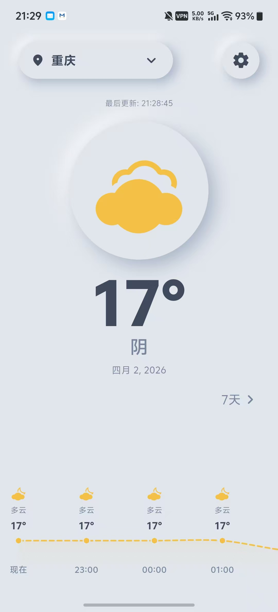
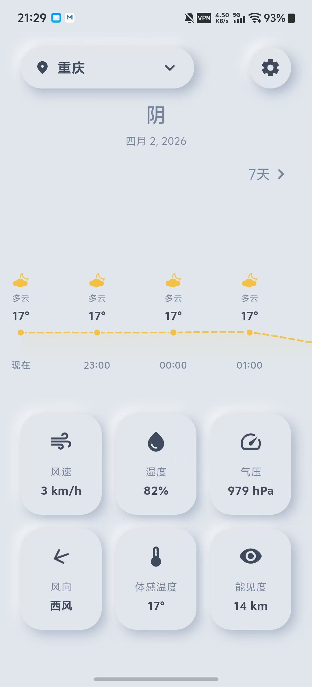
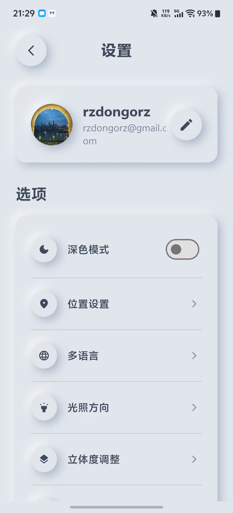
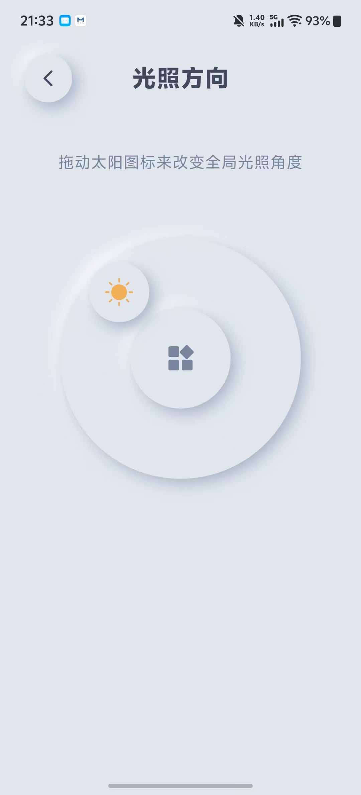
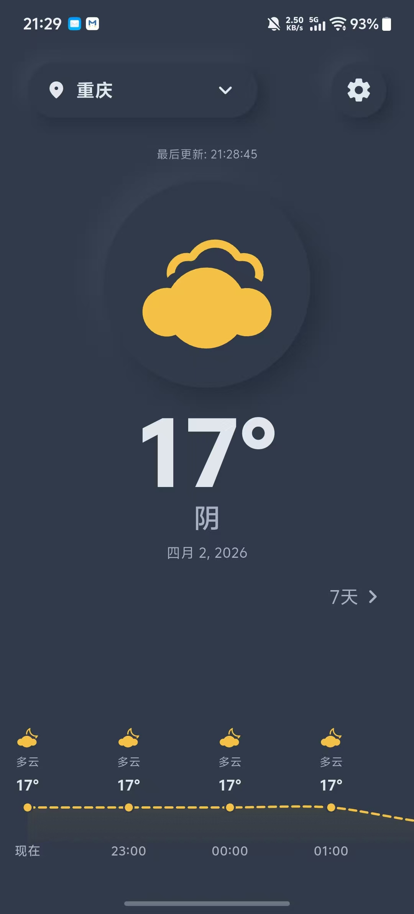
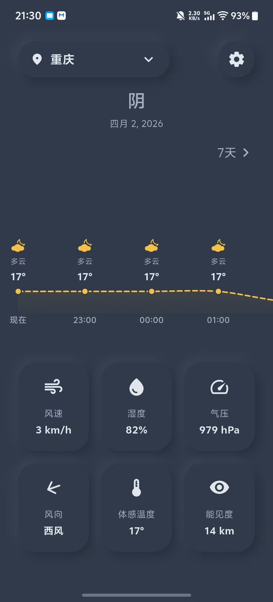
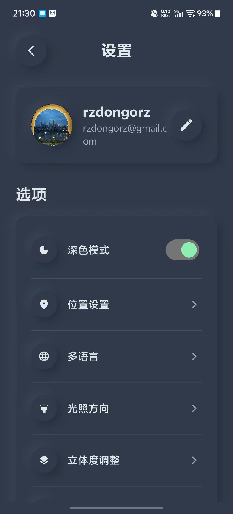
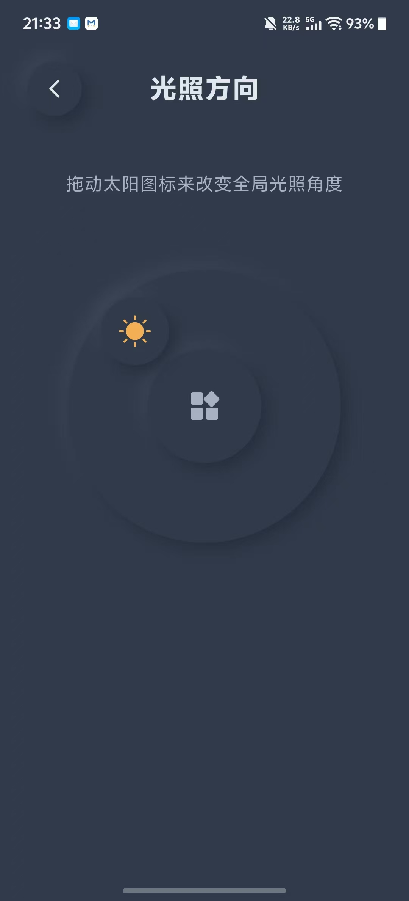

# Pencil Gallery - 小天气 (Small Weather)

**Pencil Gallery / 小天气** 是一款极具艺术气息的拟物化天气预报应用。本项目不仅追求天气数据的准确性，更致力于通过极致的拟物化（Neumorphism）视觉交互，为用户提供有温度的产品体验。

## 🎨 设计与原型

本项目初始原型使用 [Pencil Project](https://pencil.evolus.vn/) 进行设计，相关原型文件见根目录下的 `pencil-weather.pen`。设计核心围绕“光影感”展开，UI 界面支持动态调整光源角度及阴影强度，实现仿佛真实的按压触感。

## 🏗️ 架构概览

本项目采用前后端分离架构，由以下主要部分组成：

- **客户端 (Frontend)**: 基于 [Flutter](./weather-app/README.md) 开发，负责核心 UI 交互与视觉展现。
- **服务端 (Backend)**: 基于 [Go + Gin](./weather-service/README.md) 开发，负责天气 API 代理、用户认证、多端同步及腾讯云 STS 凭证发放。
- **数据库 (Database)**: 使用 [MySQL](./weather-service/db.sql) 存储用户信息、城市列表及个人偏好配置。

## 📸 界面预览

### ☀️ 浅色模式 (Light Mode)

  
  
  
  

### 🌙 深色模式 (Dark Mode)

  
  
  
  

## 📥 获取应用

您可以直接下载已编译好的 Android 安装包：

- [app-release.apk](./app-release.apk)

## 🛠️ 开始开发

请分别参考各子目录下的详细文档：

1.  **[前端应用 (weather-app)](./weather-app/README.md)**: 了解如何配置 Flutter 环境并运行 iOS/Android 代码。
2.  **[后端服务 (weather-service)](./weather-service/README.md)**: 了解如何配置 MySQL、SMTP、腾讯云 COS 及 Go 环境。

